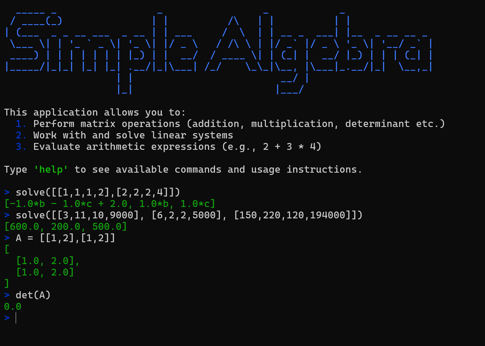
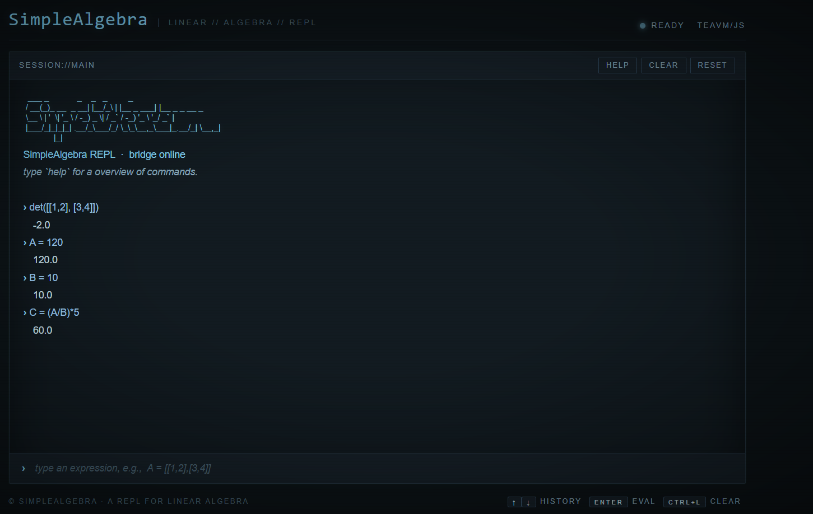

# SimpleAlgebraSoftware

This is a lightweight tool for matrices, linear systems and expressions

## Features
- **Interactive REPL** with variable bindings that persist across inputs
- **Linear system solver** using Gaussian elimination with back-substitution
- **Parametric solutions** for underdetermined systems — free variables are 
  introduced and propagated symbolically, so the result is a vector of 
  linear expressions rather than a number
- **Matrix operations** — multiplication and determinant calculation

## Supported Commands
- `help` - display available commands
- `exit` - exit the application
- `solve(matrix)` – solve a linear system with linear expressions
- `det(matrix)` – calculate the determinant
- Variable assignment: `A = ...`
- Expression evaluation: `C = A + B * (A+B)/ 3`

## Architecture
 
The CLI processes every input line through a small compiler-style pipeline:
 
```
Input ──► Lexer ──► Parser ──► AST ──► Evaluator / Solver ──► Output
```
 
- **Lexer** – tokenizes the input stream (numbers, identifiers, operators, brackets, matrix literals).
- **Parser** – a handwritten recursive-descent parser that respects operator precedence and
  associativity, and builds a typed Abstract Syntax Tree.
- **AST** – node types for scalars, vectors, matrices, variables, binary/unary operations and
  built-in function calls (`solve`, `det`).
- **Evaluator** – walks the AST, resolves variable bindings from the environment, and dispatches
  operations based on operand types (scalar × scalar, scalar × matrix, matrix × matrix, …).
- **Gauss Solver** – performs Gaussian elimination with back-substitution
  on the augmented matrix. When the system is
  underdetermined, free variables are introduced and the result is returned as a vector of linear
  expressions rather than a single numeric solution.
## Implementation Details
- **Language:** Java
- **Parser strategy:** handwritten recursive descent (no parser generator / no external library)
- **Symbolic layer:** a minimal linear-expression type supports addition, subtraction and scalar
  multiplication, which is what the Gauss solver needs to express parametric solutions
- **Tests:** a JUnit test suite covers the lexer, parser, evaluator and solver, including edge cases
  such as singular matrices, underdetermined systems and nested expressions

## Usage
Start the CLI application and enter expressions, variables or commands directly.<br>

Type `help` to see all available commands.
Type `exit` to quit the application.

## Examples

### Work with Variables and Expressions

```
> A = (1+2)*3
9.0
> B = 15
15.0
> C = A/B
0.6
```

### Solve linear systems

```
> solve([[3,11,10,9000], [6,2,2,5000], [150,220,120,194000]])

[600.0, 200.0, 500.0]

> A = [[1, 1, 0, 0, 0, 0, 0, 1],
       [0, 1, 1, 0, 0, 0, 0, 2],
       [0, 0, 1, 1, 0, 0, 0, 3],
       [0, 0, 0, 1, 1, 1, 1, 4]]
       
> solve(A)

[1.0*e + 1.0*f + 1.0*g - 2.0,
 -1.0*e - 1.0*f - 1.0*g + 3.0,
 1.0*e + 1.0*f + 1.0*g - 1.0,
 -1.0*e - 1.0*f - 1.0*g + 4.0,
 1.0*e, 1.0*f, 1.0*g]
```

### Multiply matrices and calculate determinants

```

> A = [[1,2],[3,4]]
[
  [1.0, 2.0],
  [3.0, 4.0]
]
> B = [[1,2],[3,4]]
[
  [1.0, 2.0],
  [3.0, 4.0]
]
> det(A*B)
4.0

```

## Showcase

### CLI Version



### WEB Version



## Mathematical Scope
- Scalar expressions in $\mathbb{R}$
- Vectors in $\mathbb{R}^n$
- Matrices in $\mathbb{R}^{n \times m}$
- No symbolic simplification beyond linear expressions
- Expressions evaluation with variables and constants either in $\mathbb{R}$ or $\mathbb{R}^{n \times m}$

## Releases
Are you curious about the app?<br>  
Check out the [release on GitHub](https://github.com/Biter01/SimpleAlgebraSoftware/releases/tag/v1.1) 🎉

